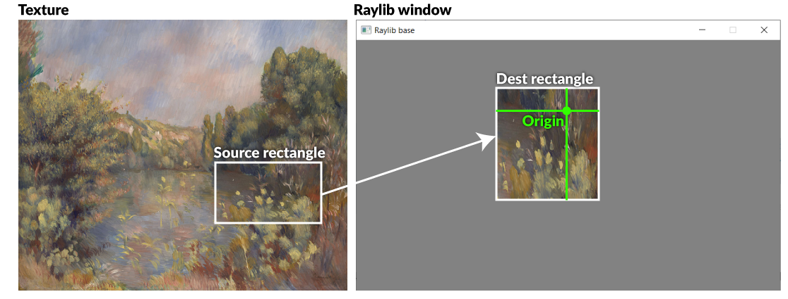

# Bilder och texturer

## Bilder och texturer

I Raylib skiljer man på _Images_ och _Textures_.

Skillnaden är att Images kan _manipuleras mer_. Textures kan _ritas ut till skärmen_.

### Filformat som stöds

* png
* bmp
* tga
* gif (dock ej animationer)
* dds, hdr, ktx, astc

Observera att det saknas stöd för jpg – detta eftersom jpg är väldigt ovanligt i spel.

## Texture

En Texture är en bild som är sparad i grafikkortets minne, och är redo att ritas ut på skärmen. Man kan skapa en Texture utifrån en [Image ](bilder-och-texturer.md#image)eller läsa in en bildfil från hårddisken direkt.

### Width och height

Varje texture har en width och en height.

```csharp
Console.WriteLine($"Width: {goombaTexture.width});
Console.WriteLine($"Height: {goombaTexture.height});

Rectangle hitBox = new Rectangle(0, 0, goombaTexture.width, goombaTexture.height);
```

### LoadTexture

Läser in en bildfil och skapar en texture direkt från den.

```csharp
Texture2D goombaTexture = Raylib.LoadTexture(@"goomba.png");
```

### LoadTextureFromImage

Skapar en ny texture baserat på en [Image](bilder-och-texturer.md#image).

```csharp
Texture2D heroTexture = Raylib.LoadTextureFromImage(originalImage);
```

### DrawTexture

Ritar ut en texture till fönstret.

```csharp
// Ritar texturen heroTexture till fönstret, på x-position 40 och 
// y-position 300, utan infärgning (WHITE färgar inte)
Raylib.DrawTexture(heroTexture, 40, 300, Color.WHITE)
```

### DrawTextureEx

En lite mer avancerad version av DrawTexture, som dels använder en vektor för att ange x och y-värden, dels låter oss ange rotation och skalning av texturen.

```csharp
// Ritar texturen heroTexture till fönstret, på x-position 40 och 
// y-position 300, utan infärgning (WHITE färgar inte)
// Använd skalning 0.5 och rotation 0.
Vector2 position = new Vector2(40, 300);
Raylib.DrawTexture(heroTexture, position, 0, 0.5f, Color.WHITE)
```


**OBSERVERA:** För att kunna använda [Vector2 ](../../grundlaeggande/vektorer-numerics.md)så måste du lägga in detta bland dina using-statements:

```csharp
using System.Numerics;
```


### DrawTexturePro

En ännu mer avancerad version av DrawTexture. Här används två rektanglar, en vektor och en float för att ange vilken del av texturen som ska klippas ut, var den ska placeras och med vilka proportioner, kring vilken punkt den ska roteras och hur mycket den ska roteras.

Det här kan man bland annat använda sig av när man har en bild som är ett s.k. sprite sheet, där alla bildrutor i en karaktärs animation finns med. Man behöver då inte klippa upp animationen i en massa olika bildfiler utan kan istället använda DrawTexturePro för att kopiera en del av bilden till raylibfönstret i taget.

Bilden nedan visar principen:



DrawTexturePro kan också användas för vanliga texturer, som man vill rita ut roterade. Nedan är kod som ritar ut en textur som från början är 200×200 pixlar stor till Raylibfönstret.



```csharp
Raylib.DrawTexturePro(
  texture, 
  new Rectangle(0,0,200, 200), // Source
  new Rectangle(200,200,200,200), // Dest(ination)
  new Vector2(100,100), // Origin
  rotation,
  Color.WHITE );
```



## Image

En Image är en bild som är sparad i datorns arbetsminne, och kan manipuleras på olika sätt.

För att man ska kunna rita ut den till fönstret behöver man sedan konvertera den till en [texture](bilder-och-texturer.md#texture). Det gör man genom [LoadTextureFromImage](bilder-och-texturer.md#loadtexturefromimage).

### Width och height

Varje image har en width och en height.

```csharp
Console.WriteLine($"Width: {filebasedImage.width});
Console.WriteLine($"Height: {filebasedImage.height});

Rectangle hitBox = new Rectangle(0, 0, filebasedImage.width, filebasedimage.height);
```

### LoadImage

Läser in en bildfil från hårddisken och lagrar den i minnet som en Image.

**OBS!** bilden måste ligga i samma mapp som Program.cs-filen!

```csharp
Image filebasedImage = Raylib.LoadImage(@"hero.png");
```

### GenImageColor

Skapar en ny blank image i minnet, fylld av den angivna färgen.

```csharp
// Skapar en svart bild som är 200x200 pixlar.
Image emptyImage = Raylib.GenImageColor(200, 200, Color.BLACK);

// Skapar en röd bild som är 200x200 pixlar.
Image emptyImage = Raylib.GenImageColor(200, 200, Color.RED);
```

### ImageDrawPixel

Ändrar färg på en pixel i en Image.

```csharp
// Ändrar pixeln som är 20 pixlar från vänsterkanten och 15 från 
// toppen av bilden till att bli blå
Raylib.ImageDrawPixel(ref targetImage, 20, 15, Color.BLUE);
```

### ImageFlipHorizontal

Flippar en Image horisontellt (spegelvänder).

```csharp
Raylib.ImageFlipHorizontal(ref targetImage);
```

### ImageFlipVertical

Flippar en Image vertikalt.

```csharp
Raylib.ImageFlipVertical(ref targetImage);
```

### ImageResize/ImageResizeNN

Ändrar storlek på en bild. NN-versionen ger ett skarpt resultat vilket fungerar bra för pixelart som skalas med jämna multiplikationer.

```csharp
//Ändrar storleken på bilden "someImage" till 400x400 pixlar
Raylib.ImageResize(ref someImage, 400, 400);

//Ändrar storleken på bilden "pixelartImage" till dubbla dess nuvarande storlek
RayLib.ImageResizeNN(ref pixelartImage, pixelartImage * 2, pixelartImage * 2);
```


