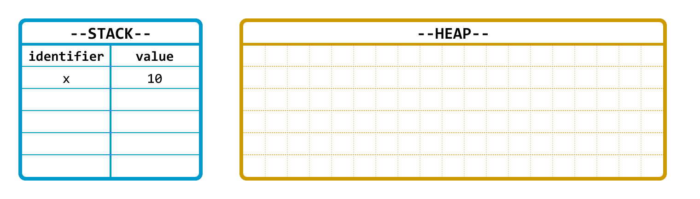
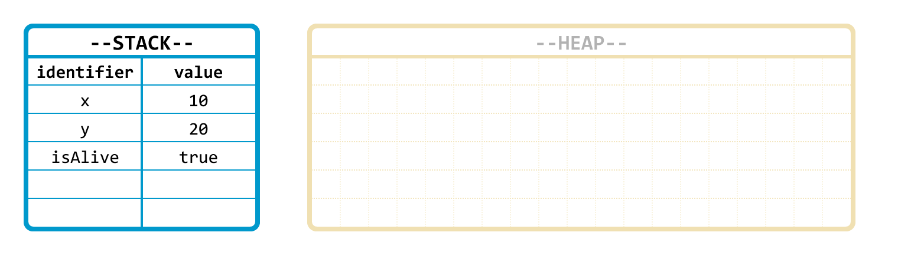
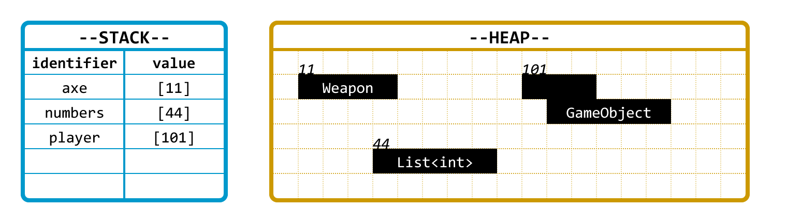
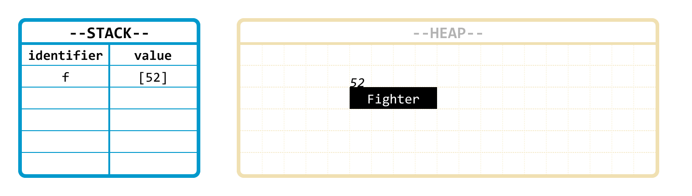
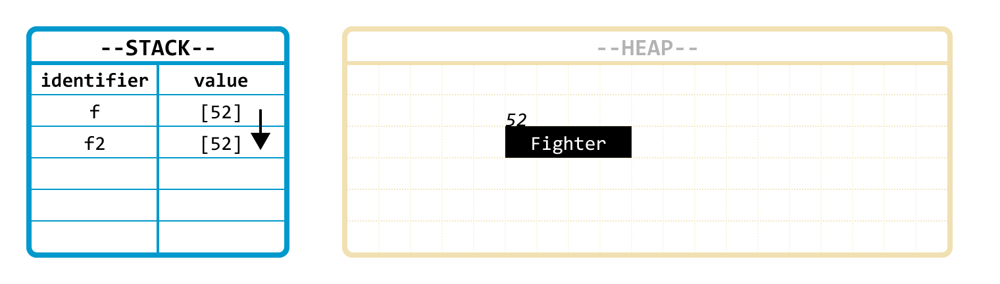

# Reference vs value types\*


**OBS:** Lite överkurs =)


## Identifiers

Variabelnamn är egentligen bara namn på specifika minnesplatser i datorns RAM-minne.


```csharp
int t; // Reservera 32 bitar i datorns minne för att lagra heltal, 
       //  och namge den minnesadressen "t"
t = 8; // Lagra heltalet 8 i den minnesaddress som har namnet "t".
```


Namnet något får kallas för en **identifier**.

## Minnet – stacken och heapen

Förenklat delas datorns minne upp i två delar: **Stacken** och **heapen**.

**Stacken** är strukturerad, snabb och begränsad i storlek. Det man lägger i den finns bara kvar så länge det nuvarande kodblocket körs.

**Heapen** är ostrukturerad, stor och det man lägger i den lever kvar tills det tas bort. I en del språk betyder det att man alltid måste komma ihåg att ta bort saker som ligger där manuellt – i C# och en del andra språk finns s.k. Garbage Collection som då och då rensar bort saker i heapen som det inte längre finns någon identifier som pekar mot.

**Identifiers finns alltid i stacken.** I stacken skapas en koppling mellan identifiern och vad den är satt att identifiera. Så till exempel skapas här en koppling mellan identifiern "x" och värdet "10".

<figure><figcaption></figcaption></figure>

## Value types

För datatyper som är **value types** lagras också **värdet** i stacken. Int är ett exempel på value type. Så när int-variabeln t skapas så är det i stacken namnet "t" associeras med ett 32-bitar stort minnesutrymme.

Exempel på value types:

* int, float och övriga numeriska typer.
* bool
* struct-typer

<figure><figcaption></figcaption></figure>

## Reference types

För datatyper som är reference types lagras själva objektet, datan, i heapen. Det enda som lagras på minnesadressen i stacken är en **referens** vidare till platsen i stacken där datan finns.

Så identifiern pekar på en plats i stacken, på den platsen finns en vidarepekning till en plats i heapen.

<figure><figcaption><p>I stacken är axe-identifiern inte kopplad direkt till en instans av Weapon, utan till en minnesadress där det finns en sån instans.</p></figcaption></figure>

## Varför är det här viktigt?

### Tilldelning

Value types och reference types beter sig olika när tilldelnings-operatorn = används. Mer exakt beter de sig exakt lika – men eftersom de lagrar olika saker i stacken så blir effekten olika.


```csharp
int a = 9;
int b = a; // Kopierar stack-positionen som identifiern a pekar på
           //  till stack-positionen som identifiern b pekar på.
```


<figure><figcaption></figcaption></figure>

<figure><figcaption></figcaption></figure>


```csharp
Fighter f = new Fighter(); // Instans skapas av klassen Fighter.
                           // Instansen lagras i heapen.
                           // Identifiern f skapas och pekar mot en plats i stacken.
                           // På den platsen finns en pekning till instansens plats
                           //  i heapen.

Fighter f2 = f; // Identifiern f2 skapas.
                // Det som finns på platsen i stacken som f pekar mot
                // kopieras till platsen som f2 pekar på.
                // Inget nytt objekt skapas i heapen – både f1 och f2 pekar mot
                //  samma objekt.
```


<div>

<figure><figcaption><p>Innan tilldelningen av f2 finns bara f, som pekar till en Fighter-instans i heapen.</p></figcaption></figure>

 

<figure><figcaption><p>Efter tilldelningen av f2 finns fortfarande bara en Fighter-instans; det som kopieras är innehållet i stacken – alltså pekaren.</p></figcaption></figure>

</div>

### Parametervärden

Ovanstående gäller också parametrar i metoder.


```csharp
int k = 9;

TakeInt(k); // talet 9 kopieras från k-identifiern till i-identifiern.

static void TakeInt(int i)
{
  // variabeln i pekar mot sin helt egna kopia av talet 9.
}
```



```csharp
Fighter f = new Fighter();

TakeFight(f); // Referensen till fighter-instansen kopieras från f till localFighter

Console.WriteLine(f.hp); // visar att f's hp-värde ändrades inuti metodenc

static void TakeFight(Fighter localFighter)
{
  // Variabeln localFighter pekar mot samma instans som variabeln f.
  localFighter.hp -= 9; // Ändrar på instansens hp-värde
}
```


## Out och ref

(Kommer…)


