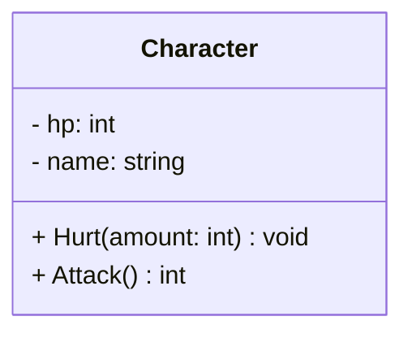

# Klassdiagram

Ett klassdiagram beskriver hur en klass är strukturerad, och ser likadant ut oavsett programmeringsspråk. Diagrammet här skulle t.ex. kunna omvandlas till kod i Java, C#, PHP eller vilket annat språk som helst som har objektorientering.

I ett klassdiagram beskrivs klassen i tre sektioner:

* Klassnamnet — i det här fallet "Character".
* Variabler — i det här fallet hp och name.
* Metoder — i det här fallet Hurt och Attack.

**Variablerna:** Skrivs med namn och datatyp, men aldrig värde. Oftast skriver man namnet först, sedan kolon, och slutligen datatypen.

**Metoderna:** Skrivs med namn, parametrar och returtyp, men aldrig funktion. Oftast skriver man namnet först, sedan parametrarna inom parentes (i samma form som man skrev variablerna), och slutligen vilken datatyp metoden returnerar.

**Synlighet:** Man anger synlighet för variabler och metoder genom att skriva +, - eller # innan namnet.

* \+ betyder "public"
* \- betyder "private"
* \# betyder "protected"

&#x20;

## Arv i klassdiagram

För att visa [arv ](arv.md)i klassdiagram används pilar.

Pilarna pekar alltid FRÅN subklassen TILL basklassen.

Subklassernas diagram ritas på samma sätt som basklassens. Man skriver in klassens variabler och metoder, inklusive metoder som använder [override](polymorfism/virtual-override.md). Däremot skriver man inte in variabler eller metoder som bara ärvs från basklassen.

&#x20;

## Vanliga frågor

* **Har man med variablers värde?** Nej, bara datatyp, namn och access modifier (public, private, protected)
* **Har man med metoders innehåll?** Nej, bara datatyp (returtyp), namn, parametrar (med namn och datatyp) och access modifier.
* **Hur gör man med listor?** Precis som vanligt, en int-listas datatyp skrivs som "List\<int>".
* **Hur gör man med properties?** Man kan lista dem som vanliga klassvariabler. NClass visar dem i metod-sektionen, kompletta med get och set. Det är också helt OK.

## NClass

NClass är ett enkelt program för att skapa klassdiagram. Det är gratis och [kan laddas ner här](https://github.com/gbaychev/NClass/releases).&#x20;


**Observera:** Länken leder till en ny fork av den gamla versionen av NClass. Den nya verkar utvecklas aktivt och har t.ex. stöd för Ctrl+Z och nyare projekt i sin code generation (Visual Studio 2019… Fortfarande inte Dotnet 5/6 tyvärr)

