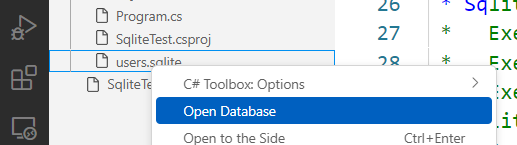

# Debugging

 Debugging är ett sätt att undersöka vad som händer i ens kod medan den körs. Genom att lägga in **breakpoints** på specifika rader i sin kod så "pausas" körningen där och man kan se vilka värden programmets olika variabler har just då.

Du skapar en breakpoint genom att klicka till vänster om radnumret. Då placeras en liten röd prick där. Du kan plocka bort din breakpoint genom att klicka på den röda pricken.

   
  

När du sedan kör/debuggar ditt program \(F5\) så pausas körningen vid din breakpoint.

Du kan då se vilket värde olika variabler har under Variables i Run-vyn.

 

Du kan fortsätta körningen genom att klicka på "Continue".

 

Du kan också fortsätta körningen rad för rad genom att klicka "Step Over" \(F10\) eller "Step Into" \(F11\).

Med Step Over stannar du i den nuvarande metoden.

Med Step Into följer du även med in i metoder som anropas.

